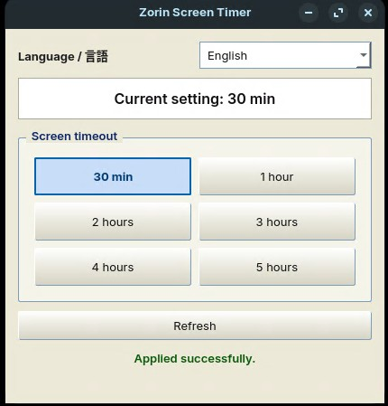

# Zorin Screen Timer

Zorin Screen Timer is a small PySide6 desktop utility for Zorin OS and Ubuntu GNOME-based desktops. It lets you set longer screen blank timeout values than the standard Zorin settings UI may expose: 30 minutes, 1 hour, 2 hours, 3 hours, 4 hours, and 5 hours.

The app uses a light Windows XP-style interface, shows the currently selected timeout, and supports English and Japanese UI text.

Repository name assumption: `zorin-screen-timer`

## Screenshot




Add a screenshot here after capturing the app on Zorin OS.

```text
docs/screenshot.png
```

## Supported Environment

- Zorin OS
- Ubuntu GNOME-based desktops
- Python 3
- `gsettings`

This app is intended for GNOME-compatible environments. It may not work on desktops where `gsettings` or `org.gnome.desktop.session idle-delay` is unavailable.

## Install

Download from GitHub Releases.

1. Download `ZorinScreenTimer-v1.0.0.zip` from the Releases page.
2. unzip
3. cd ZorinScreenTimer
4. Run:

```bash
./install.sh
```

For users who prefer the file manager:

1. Extract the ZIP.
2. Open the extracted folder.
3. Right-click inside the folder and choose "Open in Terminal".
4. Run:

```bash
./install.sh
```

The installer copies the app to:

```bash
~/.local/share/zorin-screen-timer
```

It also creates a Python virtual environment, installs PySide6, and installs launchers for the app menu and desktop.

## Launch

Launch from app menu or desktop icon.

You can also run it directly:

```bash
~/.local/share/zorin-screen-timer/run_zorin_screen_timer.sh
```

## Uninstall

From the extracted release folder, run:

```bash
./uninstall.sh
```

If the extracted folder is no longer available, run:

```bash
~/.local/share/zorin-screen-timer/uninstall.sh
```

## Changed Setting

This app changes only this GNOME setting:

```bash
org.gnome.desktop.session idle-delay
```

Manual check:

```bash
gsettings get org.gnome.desktop.session idle-delay
```

Manual test set:

```bash
gsettings set org.gnome.desktop.session idle-delay 1800
```

Depending on the environment, `gsettings get` may print either `uint32 1800` or `1800`. The app accepts both forms.

## Notes

- This changes the time until the screen turns off or blanks.
- This does not change the lock-screen timeout.
- Some environments may not support `gsettings` or the GNOME `idle-delay` key.

## Create a GitHub Release ZIP

For maintainers:

```bash
./create_release.sh 1.0.0
```

This creates:

```bash
release/ZorinScreenTimer-v1.0.0.zip
```

Upload that ZIP to GitHub Releases.

## Development Checks

```bash
python3 -m py_compile /home/x/app.py
bash -n install.sh uninstall.sh run_zorin_screen_timer.sh create_release.sh
```

## License

MIT License. See [LICENSE](LICENSE).
